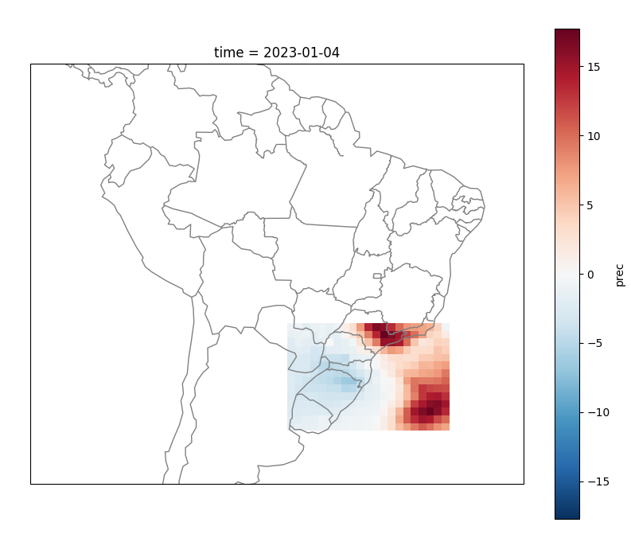
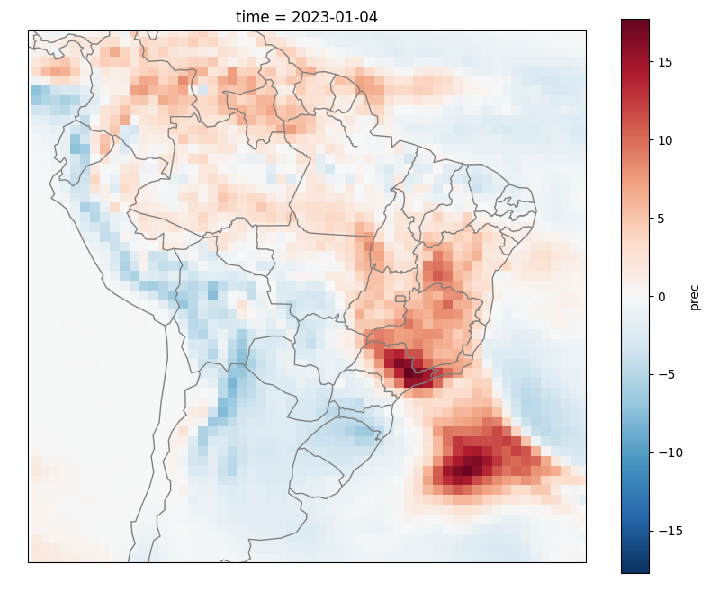

Exemplos Python
===============

.. warning::
   Alterar para os valores exibidos na inicialização.

   Inicialização comando:
   sub = SUB.model()

  
.. note::
   **#### The Brazilian Global Atmospheric Model (TQ0666L064 / Hybrid) #####**
   
   **Forecast data available for reading.**

   2023-01-04 - 2023-01-11 - 2023-01-18 - 2023-01-25 - 2023-02-01
   2023-02-08 - 2023-02-15 - 2023-02-22 - 2023-03-01 - 2023-03-08
   2023-03-15 - 2023-03-22 - 2023-03-29 - 2023-04-05 - 2023-04-12
   2023-04-19 - 2023-04-26 - 2023-05-03 - 2023-05-10 - 2023-05-17
   2023-05-24 - 2023-05-31 - 2023-06-07 - 2023-06-14 - 2023-06-21
   2023-06-28 - 2023-07-05 - 2023-07-12 - 2023-07-19 - 2023-07-26
   2023-08-02 - 2023-08-09 - 2023-08-16 - 2023-08-23 - 2023-08-30
   2023-09-06 - 2023-09-13 - 2023-09-20 - 2023-09-27 - 2023-10-04
   2023-10-11 - 2023-10-18 - 2023-10-25 - 2023-11-01 - 2023-11-08
   2023-11-15 - 2023-11-22 - 2023-11-29 - 2023-12-06 - 2023-12-13
   2023-12-20 - 2023-12-27 - 2024-01-03 - 2024-01-10 - 2024-01-17
   2024-01-24 - 2024-01-31 - 2024-02-07 - 2024-02-14 - 2024-02-21
   
   **Variables:** {'prec', 'prec_ca', 't2mt', 't2mt_ca', 'psnm', 'role', 'tp85',
   'zg50', 'uv85', 'uv20', 'vv85', 'vv20', 'cr85', 'cr20'}
   
   **Products:** {'week', 'fort', '3wks', 'mnth'}
  
   **Field:** {'anomalies', 'prob_positve_anomaly', 'prob_terciles', 'totals'}
  
  

Recuperar Dados do Modelos Numérico SubSazonal
----------------------------------------------
.. code-block:: console

  # Importa a ferramenta
  import subsaz.CPTEC_SUB as SUB
  
  # Inicializa o construtor
  sub = SUB.model()

  # Data Condição Inicial (IC)
  date = '20230104'

  # variavel
  var = 'prec'

  # produto
  product = 'week'

  # campo
  field = 'anomalies'

  # passo depende do produto escolhido
  step = '01'

  # Requisição dos dados
  f = sub.load(date=date, var=var, step=step, product=product ,field=field)

  # Retorna um Xarray
  print(f)
  # <xarray.Dataset> Size: 300kB
  # Dimensions:  (time: 1, lat: 192, lon: 384)
  # Coordinates:
  #  * lat      (lat) float64 2kB -89.28 -88.36 -87.42 -86.49 ... 87.42 88.36 89.28
  #  * lon      (lon) float64 3kB 0.0 0.9399 1.88 2.82 ... 357.2 358.1 359.1 360.0
  #  * time     (time) datetime64[ns] 8B 2023-01-04
  # Data variables:
  #    prec     (time, lat, lon) float32 295kB -0.02726 -0.0294 ... 0.9935 0.9946
  # Attributes:
  #    center:   National Institute for Space Research - INPE
  #    model:    The Brazilian Global Atmospheric Model (TQ0666L064 / Hybrid)

  quit()

Download :download:`get_data_sub_oper.py <examples/get_data_sub_oper.py>`.

Recuperar Dados e Salvar em NetCDF
-------------------------------

.. code-block:: console

  # Importa a ferramenta
  import subsaz.CPTEC_SUB as SUB
  
  # Inicializa o construtor
  sub = SUB.model()

  # Data Condição Inicial (IC)
  date = '20230104'

  # variavel
  var = 'prec'

  # produto
  product = 'week'

  # campo
  field = 'anomalies'

  # passo depende do produto escolhido
  step = '01'

  # Requisição dos dados
  f = sub.load(date=date, var=var, step=step, product=product ,field=field)

  # Salvar XArray em NetCDF
  f.to_netcdf('sub_202301104.nc')

  quit()

Download :download:`get_sub_netcdf.py <examples/get_sub_netcdf.py>`.

Recuperar Dados e Plotar Figura
-------------------------------

.. code-block:: console

  # Importa a ferramenta
  import subsaz.CPTEC_SUB as SUB
  import matplotlib.pyplot as plt

  # Inicializa o construtor
  sub = SUB.model()

  # Data Condição Inicial (IC)
  date = '20230104'

  # variavel
  var = 'prec'

  # produto
  product = 'week'

  # campo
  field = 'anomalies'

  # passo depende do produto escolhido
  step = '01'

  # Requisição dos dados
  f = sub.load(date=date, var=var, step=step, product=product ,field=field)

  # Plotar a figura com a variavel prec
  f.prec.plot()
  plt.show()

  quit()

Download :download:`plot_sub_figure.py <examples/plot_sub_figure.py>`.

Recuperar Dados com recorte de área
-----------------------------------

.. code-block:: console

   pip install cartopy

.. code-block:: console

   import subsaz.CPTEC_SUB as SUB
   import matplotlib.pyplot as plt
   import cartopy.crs as ccrs
   import cartopy.feature as cfeature

   # Inicializa o construtor
   sub = SUB.model()
   # Filtrar area definida
   sub.dict['area']['reduce'] = True 
   sub.dict['area']['minlat'] = -34.44
   sub.dict['area']['maxlat'] = -21.43
   sub.dict['area']['minlon'] = 301.14
   sub.dict['area']['maxlon'] = 320.57
   # Requisição dos dados
   f = sub.load(date='20230104', var='prec', step='01', product='week' ,field='anomalies')
   # Definir tamanho da figura
   fig = plt.figure(figsize=(10,8))
   # Setar figura unica
   ax = fig.add_subplot(111, projection=ccrs.PlateCarree())
   # Colocar  Linhas de Borda dos paises e linhas costeiras
   ax.add_feature(cfeature.COASTLINE,color='grey')
   ax.add_feature(cfeature.BORDERS,color='grey')
   # Definir Regiao do Brasil
   ax.set_extent([-90,-30,10,-41], ccrs.PlateCarree())
   # Setar estados do Brasil
   states = cfeature.NaturalEarthFeature(category='cultural',
                                            name='admin_1_states_provinces_lines',
                                            scale='50m', facecolor='none')
   # Colocar Estados Brasil
   ax.add_feature(states, edgecolor='gray')
   # Plotar variavel
   f.prec.plot()
   plt.show()

|pic1|

Download :download:`plot_sub_filter.py <examples/prec_sub_filter.py>`.

  
.. note::
   Para filtrar somente os dados do Brasil existe uma configuração padrão. Utilizar somente
   o comando: 
   **sub.dict['area']['reduce'] = True**    

|pic2|

   
